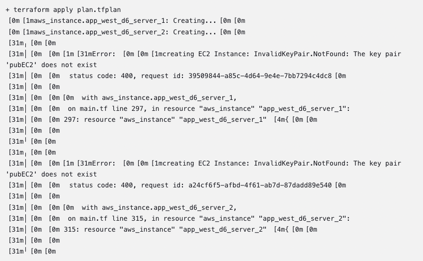

<p align="center">

</p>
<h1 align="center">Bank_App_Deployment-6<h1>

# Purpose

This project demonstrated the implementation of infrastructure as code to deploy a CI/CD pipeline management infrastructure that facilitated a multi-region banking application deployment.

AWS cloud infrastructure is deployed using Terraform, setting up a Jenkins management server and Jenkins agent IaC server serving as the CI/CD management infrastructure. The management infrastructure leverages Terraform to deploy the bank web application servers in multiple regions running Python Flask with a MySQL RDS managed database.

## Deployment Files:

The following files are needed to run this deployment:

- `app.py` The main python application file
- `database.py` Python file to create application database
- `load_data.py` Python file to load data into into the database
- `test_app.py` Test functions used to test application functionality
- `requirements.txt` Required packages for python application
- `jenkins_server.sh` Bash script to install and run Jenkins
- `Jenkinsfile` Configuration file used by Jenkins to run a pipeline
- `README.md` README documentation
- `static/` Folder housing CSS files
- `templates/` Folder housing HTML templates
- `initTerraform/` Folder housing terraform files
- `initTerraform/main.tf` Terraform file to deploy AWS infrastructure
- `initTerraform/app_server_setup.sh` Bash script to install required packages for the app server

# Steps

1. In AWS, setup AWS RDS MySQL RDS database. Configured the database using these settings:

	```text
    Engine type: MySQL
    Templates: Free tier
    Deployment options: Single DB Instance
    DB instance identifierInfo: mydatabase
    Master password: **create password**
    Confirm master passwordInfo: **reenter new password**
    Public Access: Yes
    Additional Configuration
    Initial database name: banking
    Disable Encryption (unCheck Enable Encryption)
    Create Database
    ```

    Once completed, copy the database endpoint and login info to update the application code.

    ```python
    Mydatabase.c3bg2ayjf9ho.us-east-1.rds.amazonaws.com
    admin | **master password**
    ```
<br><br>

2. In the local git repository, update the application code to connect to the database. The app.py, database.py, load_data.py files need to be updated.

    ```bash
    git branch db_management
    git checkout db_management
    ```

    Edit Python Files
    ```python
    DATABASE_URL = 'mysql+mysqldb://admin:{master password}@Mydatabase.c3bg2ayjf9ho.us-east-1.rds.amazonaws.com`
    ```

    ```bash
    git add app.py database.py load_data.py
    git commit -m “commit message”
    git checkout main
    git merge db_management
    git push -u origin main
    ```
<br><br>

3. Deploy management infrastructure into default VPC using Terraform. The main.tf file houses the code to deploy the Jenkins management server & Jenkins agent IaC server. Run this command the deploy the infrastructure:<br>

    ```bash
    terraform init
    terraform plan
    terraform apply
    ```
<br><br>

4. In the AWS console, The Jenkins management server application needs to be set up with the build pipeline and agent configuration. First, verify that the Jenkins application is accessible at the public IP address outputted after applying the terraform configuration.

    ```bash
    http://<jenkins-server-public-ip>:8080
    ```

    Retrieve initial Jenkins password from the server terminal:

    ```bash
    sudo cat /var/lib/jenkins/secrets/initialAdminPassword
    ```
    
    Setup Jenkins node agent to allow an ssh connection between the Jenkins management server and Jenkins IaC server to run specified pipeline jobs on the remote host. Configure the node agent by navigating to `Dashboard` > `Build Executor Status` > `New Node`:

    - Node name: `awsDeploy`
    - Select `Permanent Agent`
    - Number of executors: `1`
    - Remote root directory: `/home/ubuntu/agent1`
    - Labels: `awsDeploy`
    - Usage: `Only build jobs with label expressions matching this node`
    - Launch method: `Launch agents via SSH`
    - Host: `<jenkins_iac_server_public_ip>`
    - Credentials: `ubuntu`
    - Host Key Verification Strategy: `Non verifying Verification Strategy`
    - Availability: `Keep this agent online as much as possible`
    - `SAVE`

    Agent will be available a few minutes after saving. 
<br>

    Setup node agent’s AWS credentials to deploy the bank application via Terraform. Configure the node agent  credentials by navigating to `Dashboard` > `Manage Jenkins` > `Credentials` > `System (Credentials)` > `Global credentials` > `Add Credentials`:

    - Kind: `Secret Text`
    - Scope `Global`
    - Secret:: `**AWS Access Key**`
    - ID: `AWS_ACCESS_KEY`
    - Description: `aws access key`
    - `Create`

    Repeat `Add Credentials` for AWS Secret Key

    - Kind: `Secret Text`
    - Scope `Global`
    - Secret: `**AWS Secret Key**`
    - ID: `AWS_SECRET_KEY`
    - Description: `aws access key`
    - `Create`

    Setup Jenkins build pipeline:

    - Login: `username | password`
    - From Dashboard, select a `new item` > `Create Name` > `Mulit-branch Pipeline` option
    - Set Branch sources:
        * Credentials: [How to setup Github Access Token](https://docs.github.com/en/enterprise-server@3.8/authentication/keeping-your-account-and-data-secure/managing-your-personal-access-tokens)
        * Repository HTTPS URL: `<Github Repo URL>`
        * Build Configuration > Mode > Script Path: Jenkinsfile
    - `Apply` and `Save`

    Run build pipeline.
<br><br>

5. Verify application deployment in each region. Terraform should’ve deployed two VPCs (`vpc_d6_east`, `vpc_d6_west`) running two application servers in each VPC (`app_east_d6_server_1`, `app_east_d6_server_2`, `app_west_d6_server_1`, `app_west_d6_server_2`).

    <br>
    <br>
    <br>
    <br>
 <br><br>

6. In order to improve the user experience, an application load balancer will be deployed to allow a single application entrypoint in each region. The application load balancer must be created in each VPC region (us-east-1, us-west-2). In the AWS console, goto `EC2` > `Load Balancing` > `Target Groups`:

   - `Create target group`
   - Target group name: `instance1`
   - Port: `8000`
   - VPC: `vpc_d6_east`
   - Click `Advance health check settings` > click `Next`
   - Health check port: `Override | 80 => 8000`
   - Select first instance: `app_east_d6_server_1`
   - Select `Include as pending below`
   - Click `Create target group`

    Run configuration again for instance2.

    - `Create target group`
    - Target group name: `instance2`
    - Port: `8000`
    - VPC: `vpc_d6_east`
    - Click `Advance health check settings` > click `Next`
    - Health check port: `Override | 80 => 8000`
    - Select first instance: `app_east_d6_server_2`
    - Select `Include as pending below`
    - Click `Create target group`

    Repeat steps in the us-west-2 region.

    - `Create target group`
    - Target group name: `instance1`
    - Port: `8000`
    - VPC: `vpc_d6_west`
    - Click `Advance health check settings` > click `Next`
    - Health check port: `Override | 80 => 8000`
    - Select first instance: `app_west_d6_server_1`
    - Select `Include as pending below`
    - Click `Create target group`

    Run configuration again for instance2.

    - `Create target group`
    - Target group name: `instance2`
    - Port: `8000`
    - VPC: `vpc_d6_west`
    - Click `Advance health check settings` > click `Next`
    - Health check port: `Override | 80 => 8000`
    - Select first instance: `app_west_d6_server_2`
    - Select `Include as pending below`
    - Click `Create target group`


    Create the load balancer for each region. Navigate to `EC2` > `Load Balancing` > `Load Balancers` (us-east-1 region):
    - `Create load balancer`
    - Click `Create` for Application Load Balancer
    - Load balancer name: `ALB-east`
    - Select VPC `vpc_d6_east` 
    - Mappings: `public_subnet_east_a, public_subnet_east_b`
    - Click `create a new security group`
        * Security group name: `ALB-HTTP`
        * Description: `ALB http traffic`
        * Click `Add rule`
        * Type: `HTTP`
        * Source: `Anywhere-IPv4`
        * Click `Create security group`
    - Security groups: `ALB-HTTP` | Disable `Default`
    - Default action: `instance1`
    - Click `Create load balancer => View load balancer`

    Navigate to `EC2` > `Load Balancing` > `Load Balancers` > `ALB-east` > `Listener and rules`: 
    - Protocol:Port: select `Select `HTTP:80`
    - Click `Manage rules => Edit rules`
    - Name tag: select `Default`
    - Click `Action => Edit rule`
    - Click ‘Add target group’
    - Target group > Select a target group: `instance2`
    - Click `Save changes`

    Repeat load balancer configuration in the West region. Navigate to `EC2` > `Load Balancing` > `Load Balancers` (us-west-2 region):

    - `Create load balancer`
    - Click `Create` for Application Load Balancer
    - Load balancer name: `ALB-west`
    - Select VPC `vpc_d6_west` 
    - Mappings: `public_subnet_west_a, public_subnet_west_b`
    - Click `create a new security group`
            * Security group name: `ALB-HTTP`
            * Description: `ALB http traffic`
            * Click `Add rule`
            * Type: `HTTP`
            * Source: `Anywhere-IPv4`
            * Click `Create security group`
    - Security groups: `ALB-HTTP` | Disable `Default`
    - Default action: `instance1`
    - Click `Create load balancer => View load balancer`<br>

    Navigate to `EC2` > `Load Balancing` > `Load Balancers` > `ALB-east` > `Listener and rules`: 

    - Protocol:Port: select `Select `HTTP:80`
    - Click `Manage rules => Edit rules`
    - Name tag: select `Default`
    - Click `Action => Edit rule`
    - Click ‘Add target group’
    - Target group > Select a target group: `instance2`
    - Click `Save changes`
<br><br>

7. Verify the application status via the load balancers DNS address:

    ```text
    ALB-east-342636552.us-east-1.elb.amazonaws.com

    ALB-west-1024536005.us-west-2.elb.amazonaws.com
    ```
    <br><br>

# System Diagram

CI/CD Pipeline Architecture [Link](https://github.com/kaedmond24/bank_app_deployment_6/blob/main/c4_deployment_6.png)

# Issues

Error: Error creating VPC: VpcLimitExceeded: The maximum number of VPCs has been reached<br>
Solution: TBA<br>
    <br>

Solution: TBA

Error: Creating EC2 Instance: InvalidKeyPair.NotFound: The key pair 'pubEC2' does not exist<br>
Solution: TBA<br>
    <br>


# Optimization

The current infrastructure could use some user experience upgrade to enhance usability of the bank application. Although the shared database would provide a unified application experience, access to the application is still left in the hands of the user. They would have to choose whether to access the application from the east region or west region load balancer's DNS address. In order to remove that decision from the end-user a DNS name can be configured to route user traffic across both load balancers based on a routing policy such as geolocation routing using Route 53. Moreover, a user-friendly domain name (e.g, cloudbank.com) can be used to make it easier for end-users to remember.
